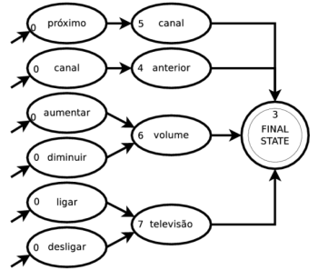

# ASR resources for CMU Sphinx in PT\_BR

[Paper](https://www.isca-speech.org/archive/IberSPEECH_2018/abstracts/IberS18_P1-13_Batista.html): **Baseline Acoustic Models for Brazilian Portuguese Using Kaldi Tools**    
A comparison between Kaldi and CMU Sphinx for Brazilian Portuguese was
performed. Resources for both toolkits were developed and made publicly 
available to the community.

- `sen4000_gau16.cd_cont_4000/`: acoustic model (AM)  
- `dict/`: phonetic dictionary (lexicon) 
- `lm/`: n-gram language model (LM) 
- `gram/`: context-free grammar (CFG) language model  

NOTE: LM and CFG are mutually exclusive: if you use LM, it is senseless to use
a grammar at the same time.

## Testing with n-gram language model
```bash
pocketsphinx_continuous \
    -inmic yes \
    -hmm sen4000_gau16.cd_cont_4000/ \
    -dict dict/sen4000_gau16.dic \
    -lm lm/lapsam.lm
```

## Testing with context-free grammar (finite state grammar)
```bash
pocketsphinx_continuous \
    -inmic yes \
    -hmm sen4000_gau16.cd_cont_4000/ \
    -dict dict/sen4000_gau16.dic \
    -fsg gram/tv_control.fsg 2> /dev/null
```

or

```bash
pocketsphinx_continuous \
    -inmic yes \
    -hmm sen4000_gau16.cd_cont_4000/ \
    -dict dict/sen4000_gau16.dic \
    -jsgf gram/tv_control.jsgf 2> /dev/null
```



## Citation

If you use these resources or want to mention the paper referred above, please 
cite us as one of the following: 

> Batista, C., Dias, A.L., Sampaio Neto, N. (2018) Baseline Acoustic Models for
> Brazilian Portuguese Using Kaldi Tools. Proc. IberSPEECH 2018, 77-81, DOI:
> 10.21437/IberSPEECH.2018-17.

```bibtex
@inproceedings{Batista2018,
    author    = {Cassio Batista and Ana Larissa Dias and Nelson {Sampaio Neto}},
    title     = {{Baseline Acoustic Models for Brazilian Portuguese Using Kaldi Tools}},
    year      = {2018},
    booktitle = {Proc. IberSPEECH 2018},
    pages     = {77--81},
    doi       = {10.21437/IberSPEECH.2018-17},
    url       = {http://dx.doi.org/10.21437/IberSPEECH.2018-17}
}
```    

[](https://ufpafalabrasil.gitlab.io/ "Visite o site do Grupo FalaBrasil") [](https://portal.ufpa.br/ "Visite o site da UFPA")

__Grupo FalaBrasil (2020)__ - https://ufpafalabrasil.gitlab.io/      
__Universidade Federal do Pará (UFPA)__ - https://portal.ufpa.br/     
Cassio Batista - https://cassota.gitlab.io/
